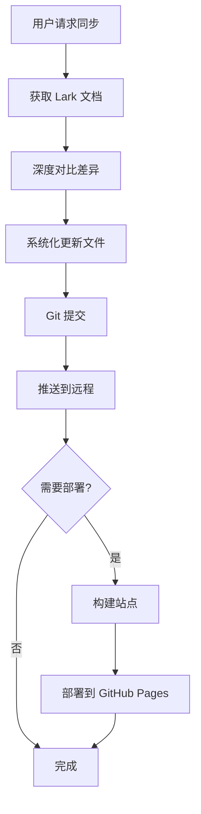

# 📚 文档同步与部署 Skill

快速参考卡片 - 用于将 Lark 文档同步到本地并部署到 GitHub Pages

## 🚀 快速使用

### 方式一：Claude Code 自动化（推荐）

只需告诉 Claude Code：

```
同步 https://uponly.larksuite.com/wiki/xxx 并部署到远程
```

或者：

```
Sync https://uponly.larksuite.com/wiki/xxx and deploy
```

Claude 会自动完成：
- ✅ 获取 Lark 文档
- ✅ 深度对比差异
- ✅ 更新本地文件
- ✅ Git 提交和推送
- ✅ 部署到 GitHub Pages

### 方式二：使用脚本

```bash
# 基础同步（不部署）
./scripts/sync-lark-and-deploy.sh --url "https://uponly.larksuite.com/wiki/xxx"

# 同步并自动部署
./scripts/sync-lark-and-deploy.sh \
  --url "https://uponly.larksuite.com/wiki/xxx" \
  --token "ghp_xxxxx"
```

## 📋 完整工作流程



## 🎯 触发关键词

Claude Code 会在以下情况自动激活此 Skill：

- "**同步** Lark 文档并 **部署**"
- "**更新**文档到远程"
- "**发布**文档"
- "Sync Lark and **deploy**"
- "Update docs to **remote**"

## 📝 示例场景

### 场景 1：完整同步和部署

**输入**：
```
同步 https://uponly.larksuite.com/wiki/StZZwcTsniQD2OkIZ0vu59dHsxd 并部署
```

**输出**：
```
✓ 已获取 Lark 文档
✓ 发现 7 处差异
✓ 更新 5 个文件
✓ 已提交: "Sync documentation from Lark"
✓ 已推送到 origin/master
✓ 已部署到 https://bybit-exchange.github.io/pay-docs/
```

### 场景 2：只同步不部署

**输入**：
```
更新文档从 Lark: https://uponly.larksuite.com/wiki/xxx
```

**输出**：
```
✓ 已获取 Lark 文档
✓ 更新 3 个文件
✓ 已提交并推送
ℹ️ 跳过部署（未提供 token）
```

### 场景 3：仅部署已有更改

**输入**：
```
直接帮我 deploy
```

**输出**：
```
✓ 构建完成
✓ 已部署到 GitHub Pages
🌐 https://bybit-exchange.github.io/pay-docs/
```

## ⚙️ 配置要求

### 必需
- ✅ Node.js (>= 16.14)
- ✅ Git 仓库
- ✅ lark-doc-skills 插件
- ✅ npm 依赖已安装

### 可选（用于部署）
- GitHub token（具有 repo 和 pages 权限）

### 自动部署（GitHub Actions）
每次推送到 `master` 分支会自动触发部署，无需手动操作。

配置文件：`.github/workflows/deploy.yml`

## 📊 质量保证

Claude Code 在同步时会：

1. **交叉验证**：对比 API 文档与数据模型
2. **一致性检查**：验证命名规范（camelCase vs snake_case）
3. **格式验证**：确保时间戳类型、货币格式一致
4. **源文档验证**：如果源文档有矛盾，保留本地正确性
5. **用户确认**：发现歧义时会询问用户

### 真实案例

上次同步中发现：
- ❌ Lark 文档示例使用 `refund_amount`（snake_case）
- ✅ 数据模型定义为 `refundAmount`（camelCase）
- ✅ 本地文档一致使用 `refundAmount`
- **决策**：保留本地正确性，向用户报告差异

## 🛠️ 故障排除

| 问题 | 原因 | 解决方案 |
|------|------|----------|
| Lark 认证失败 | Token 过期 | 使用 lark-doc skill 重新认证 |
| 构建失败 | 依赖问题 | 运行 `npm ci` 重新安装 |
| 部署失败 | Token 无效 | 检查 GitHub token 权限 |
| 推送失败 | 无远程访问权限 | 验证 git remote URL 和凭证 |
| 合并冲突 | 并发更改 | 手动解决冲突 |

## 📁 通常会更新的文件

```
docs/scan-payment/
├── introduction.mdx        # 版本历史、概述
├── guide.mdx              # 认证、API 基础
├── flow.mdx               # 流程图、状态机
├── payment-notify.mdx     # Webhook 文档
├── create-payment.mdx     # 创建支付 API
├── payment-result.mdx     # 查询支付 API
├── refund.mdx             # 退款 API
├── payout.mdx             # 付款 API
└── settlement.mdx         # 结算 API
```

## 🔗 相关文档

- [完整 Skill 文档](../../SKILL-sync-deploy.md) - 详细的工作流程说明
- [脚本源码](../../scripts/sync-lark-and-deploy.sh) - Bash 自动化脚本
- [GitHub Actions 配置](../../.github/workflows/deploy.yml) - 自动部署配置

## 💡 最佳实践

1. ✅ **对比后再更新**：不要盲目复制内容
2. ✅ **保留本地修正**：如果本地文档更准确，保留它们
3. ✅ **验证数据一致性**：检查示例是否匹配数据模型定义
4. ✅ **本地测试构建**：部署前运行 `npm run build`
5. ✅ **检查 git diff**：提交前查看更改
6. ✅ **保护 token**：永远不要提交 token

## 🎓 版本历史

| 版本 | 日期 | 变更 |
|:-----|:-----|:-----|
| 1.0.0 | 2026-01-28 | 初始发布，支持完整自动化 |

---

**Created by**: Claude Code
**Last Updated**: 2026-01-28
**Skill Version**: 1.0.0
