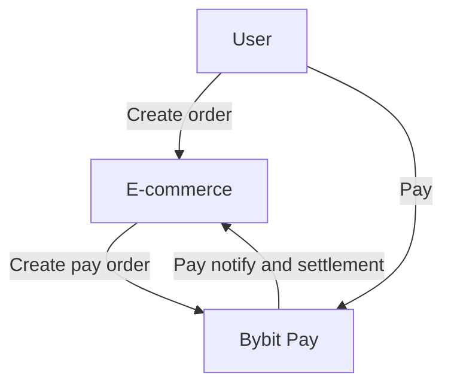
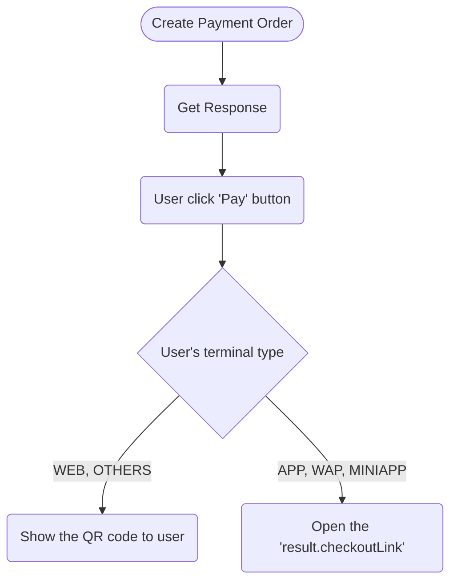
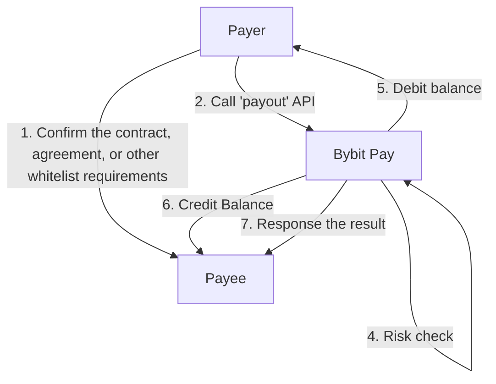
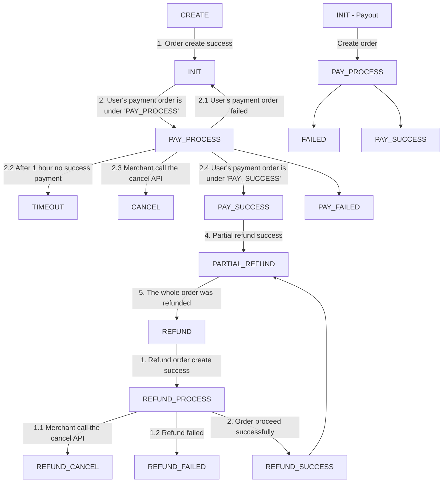

## E-Commerce Payment Flow

## Users' Guide After Creating Payment Order

## Payout Flowchart

## Order Status State Machine

:::info
For detailed status descriptions, see [Order Status](order-status).
:::
